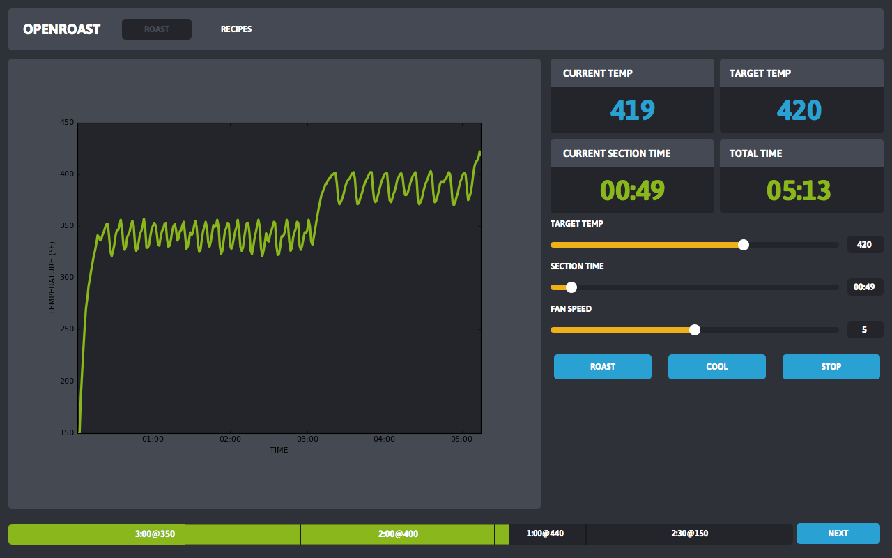
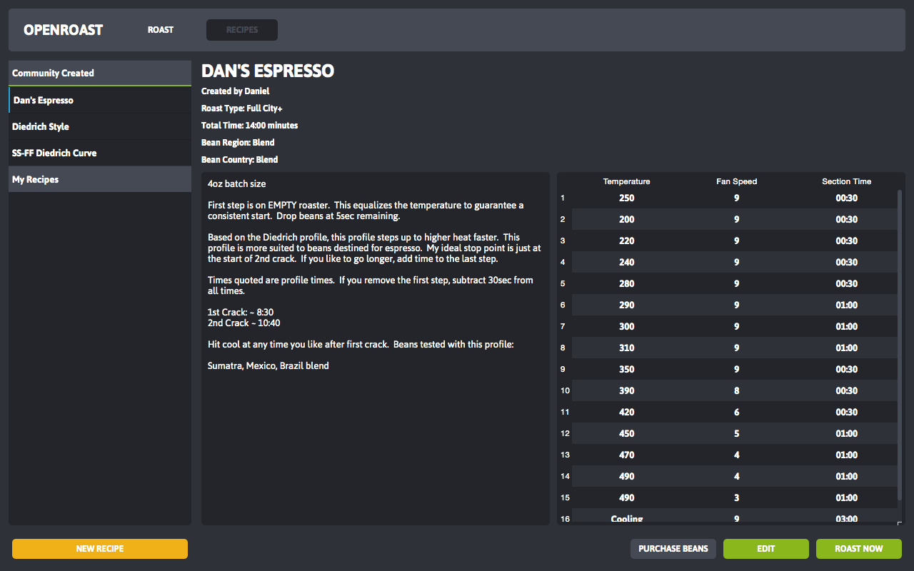

# openroast

openroast is an open source, cross-platform application for home coffee roasting. openroast is currently designed to interface with the FreshRoast SR700 USB controlled coffee roaster, with the capability of extending to any computer assisted home roasting device. openroast makes it simple to dial-in recipes in a repeatable, consistent manner allowing a user to achieve the same results every time.

## Features
- Roast Graph
- Simplified user interface
- The abaility to set temperature by number rather than low, medium, or high
- Create/Import/Export Recipes
- Software-based PID Controller

## Screenshots

## Setting Up A Development Environment
In order to setup a development environment on your desired platform, please refer to our wiki page: [Setting Up A Development Environment](https://github.com/openroast/openroast/wiki/Setting-Up-A-Development-Environment)

## License
The code is being released under GPL v3.
