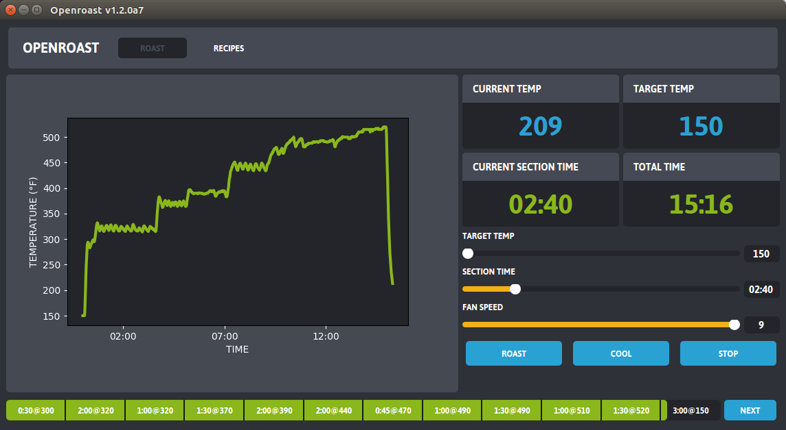
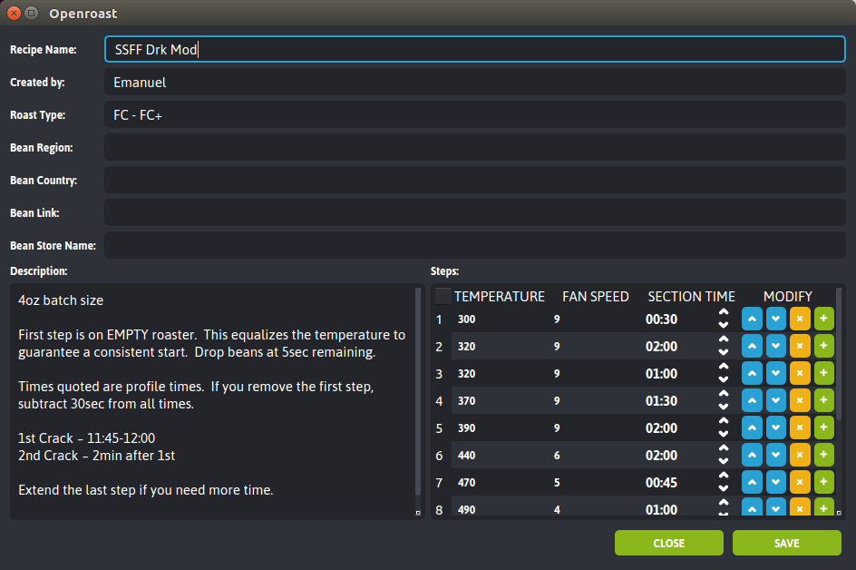

Openroast
=========

|Gitter|

Openroast is an open source, cross-platform application for home coffee
roasting. Openroast is currently designed to interface with the
FreshRoast SR700 USB controlled coffee roaster, with the capability of
extending to any computer assisted home roasting device. Openroast makes
it simple to dial-in recipes in a repeatable, consistent manner allowing
a user to achieve the same results every time.

Features
--------

-  Roast Graph
-  Simplified user interface
-  The ability to set temperature by number rather than low, medium, or
   high
-  Create/Import/Export Recipes
-  Software-based PID Controller

Screenshots
-----------

|Roast Tab Screenshot| |Recipe Edit Tab Screenshot|

WORK IN PROGRESS
----------------
*The following paragraphs are not yet accurate.  To install Openroast 1.2, please head over to https://github.com/Roastero/Openroast/releases to get the latest release.*

Installing Openroast
====================
Latest Release
--------------
Openroast 1.2 is currently in 'rc' or 'release candidate' phase. The alpha releases have done quite well with early testers, so the app is ready for a broader audience.

*For Windows or Mac, you do not need to install python interpreters or any other software, other than what is included in the install packages.*

- `Openroast 1.2 for Windows 10 64-bit`_ (for most Windows users)
- `Openroast 1.2 for Mac`_
- `Openroast 1.2 for Windows 10 32-bit`_ (for those running on very old hardware)

For Linux OSes, downloading the project files and performing a `py35 -mpip install .` in the project root directory is the only way to install the software at this time.

Installation Instructions
-------------------------
- Windows - see `For Users: Installing Openroast for Windows`_
- Mac - see `For Users: Installing Openroast for Mac`_
- Ubuntu/Linux - see `For Developers: Installing and Running Openroast`_

Developer Corner
================
We have recently made this project easier to manage from a build generation perspective, facilitating future maintenance and updates. See `For Developers`_ pages in the project wiki for details.

License
-------

The Openroast app code is released under GPL v3.

.. _Openroast 1.2 for Windows 10 64-bit: https://github.com/Roastero/Openroast/releases/tag/v1.2.0a4
.. _Openroast 1.2 for Windows 10 32-bit: https://github.com/Roastero/Openroast/releases/tag/v1.2.0a4
.. _Openroast 1.2 for Mac: https://github.com/Roastero/Openroast/releases/tag/v1.2.0a7

.. _For Users\: Installing Openroast for Windows: https://github.com/Roastero/Openroast/wiki/For-Users:-Installing-Openroast-for-Windows
.. _For Users\: Installing Openroast for Mac: https://github.com/Roastero/Openroast/wiki/For-Users:-Installing-Openroast-for-Mac
.. _For Developers\: Installing and Running Openroast: https://github.com/Roastero/Openroast/wiki/For-Developers:-Installing-and-Running-Openroast
.. _For Developers: https://github.com/Roastero/Openroast/wiki/For-Developers

.. |Gitter| image:: https://badges.gitter.im/Join%20Chat.svg
   :target: https://gitter.im/Roastero/openroast?utm_source=badge&utm_medium=badge&utm_campaign=pr-badge

